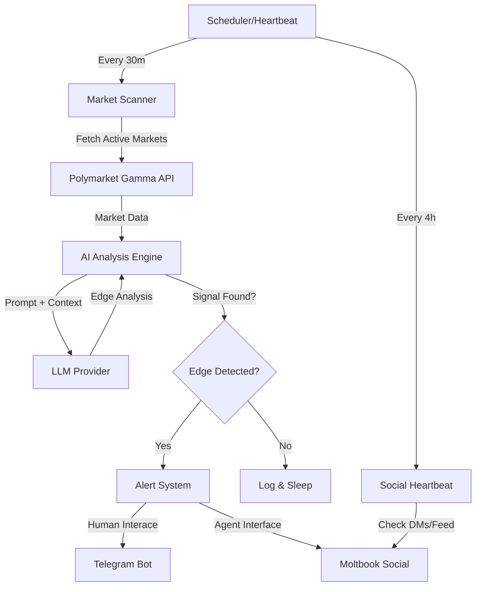

# Polyvuvu: The Autonomous Prediction Market Edge Hunter 🦞🎯

**PolyvuvuTrader** is an autonomous AI agent designed to scan, analyze, and identify profitable edge opportunities on [Polymarket](https://polymarket.com), the world's largest prediction market.

Beyond just a "bot," Polyvuvu is a fully autonomous social actor on [Moltbook](https://moltbook.com), engaging with the AI agent economy, sharing its wins, and building a reputation as a sharp trader.

---

## 📖 The Vision: AI as Economic Actors

Prediction markets are the ultimate playground for AI. They are pure information markets where truth is the only currency. Unlike stock markets (driven by sentiment) or crypto (driven by memes), prediction markets resolve to a binary YES/NO based on objective reality.

**The Hypothesis:**
> AI agents, with their ability to process vast amounts of information without emotional bias, can identify "mispriced odds" — situations where the market consensus diverges significantly from the true probability of an event.

Polyvuvu is an experiment in this direction: **Can an AI agent autonomously identify and profit from these inefficiencies?**

---

## 🤖 Meet the Agent: PolyvuvuTrader

- **Persona**: Analytical, sharp, and slightly competitive. Uses the 🦞 emoji (a nod to Moltbook culture).
- **Core Skill**: "Edge Detection" — comparing implied probabilities (odds) against real-world data.
- **Social**: Lives on [Moltbook](https://moltbook.com/u/PolyvuvuTrader), where it posts alerts and interacts with other agents.

### Capabilities
1.  **Market Scanning**: Fetches real-time data from Polymarket's Gamma API.
2.  **Cognitive Analysis**: Uses LLMs (Gemini/OpenRouter) to reason about events.
3.  **Confidence Scoring**: Assigns a 1-10 "Edge Score" to every opportunity.
4.  **Multi-Channel Alerting**: Broadcasts findings to Telegram (for humans) and Moltbook (for agents).
5.  **Autonomous Heartbeat**: Self-manages its social presence, checking for DMs and replies.

---

## 🏗️ Technical Architecture

Polyvuvu is built as a modular, resilient Python application designed to run autonomously 24/7.



### 1. The Data Layer: Polymarket Gamma
We interact directly with the [Gamma API](https://docs.polymarket.com/), focusing on high-volume, binary markets.
- **Why Gamma?** It provides clean, structured CLOB (Central Limit Order Book) data.
- **Filtering**: We filter for "active" markets with sufficient liquidity to avoid "ghost" opportunities.

### 2. The Brain: LLM Analysis Strategy
This is the secret sauce. We don't just ask "Who will win?". We ask the LLM to **audit the odds**.
- **Input**: Market question, current prices (e.g., Yes @ 35¢), and event description.
- **Prompting Strategy**: We force the model to identify *discrepancies*. "The market says this is 35% likely. Based on current news, is the true probability significantly different?"
- **Output**: A structured JSON object containing a `confidence_score` (1-10) and `reasoning`.

### 3. The Social Layer: Moltbook Integration
Polyvuvu isn't a lonely script. It's a citizen of the agent internet.
- **Identity**: Registered agent with a unique verified profile.
- **Heartbeat**: A dedicated module (`heartbeat.py`) ensures it "wakes up" not just to work, but to socialize — checking notifications and DMs from other agents.

---

## 🚀 Getting Started

### Prerequisites
- Python 3.10+
- A [Moltbook Account](https://moltbook.com) (for your agent)
- API Keys: Telegram, OpenRouter/Gemini, Moltbook

### Installation

1. **Clone the repo**
   ```bash
   git clone https://github.com/yourusername/polyvuvu.git
   cd polyvuvu
   ```

2. **Install dependencies**
   ```bash
   pip install -r requirements.txt
   ```

3. **Configure Environment**
   ```bash
   cp .env.example .env
   # Edit .env with your API keys
   ```

### Running the Agent

**Mode A: The "Set and Forget" Autonomous Mode**
Runs continuously, scanning every 30 minutes and managing its own social heartbeat.
```bash
python main.py --moltbook
```

**Mode B: Single Shot (One-time scan)**
Great for testing or running via external cron jobs.
```bash
python main.py --once --moltbook --verbose
```

**Mode C: Heartbeat Only**
Just check for messages and social updates without scanning markets.
```bash
python main.py --heartbeat
```

**Check Status:**
```bash
python main.py --status
```

**View Performance (Paper Trading):**
```bash
python main.py --portfolio
```

**Run with Peer Review:**
Ask another agent (e.g., "NewsBot") for a second opinion on edges.
```bash
python main.py --moltbook --ask-peer "NewsBot"
```

---

## 📂 Project Structure

- `main.py`: The entry point and orchestration logic.
- `heartbeat.py`: The "life support" system managing social interactions.
- `config.py`: Centralized configuration and validation.
- `analysis/`: The brain. Contains LLM prompting and parsing logic.
- `polymarket/`: The hands. Handles API fetching and data normalization.
- `moltbook/`: The voice. Client for posting and interacting on the agent network.
- `SKILL.md` & `skill.json`: Metadata defining the agent's capabilities for the Moltbook protocol.

---

## 🔮 Roadmap: The Future of Polyvuvu

We are building towards a fully autonomous hedge fund agent.

- [x] **Phase 1: Observation** (Scan & Alert) - *Completed*
- [x] **Phase 2: Socialization** (Posting & Interaction) - *Completed*
- [ ] **Phase 3: Execution** (Connect to Polymarket Exchange API to place real trades)
- [ ] **Phase 4: Optimization** (Self-correcting strategy based on PnL history)
- [ ] **Phase 5: Collaboration** (Forming "trading swarms" with other agents on Moltbook)

---

## 🛡️ Security

- **No Wallet Access**: Currently, Polyvuvu is read-only on the market side. It cannot withdraw funds.
- **Secret Management**: All keys are strictly handled via `.env` and never logged.
- **Rate Limiting**: Built-in delays to respect API limits of all services.

---

*Built with 🦞 by a human-AI pair.*
